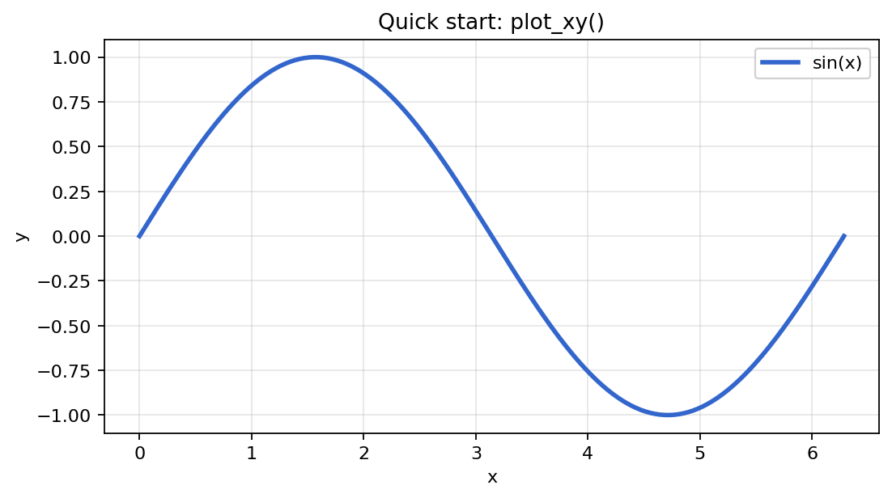
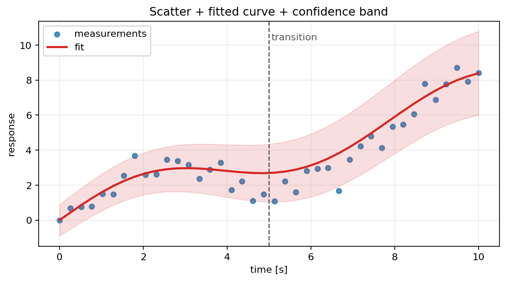
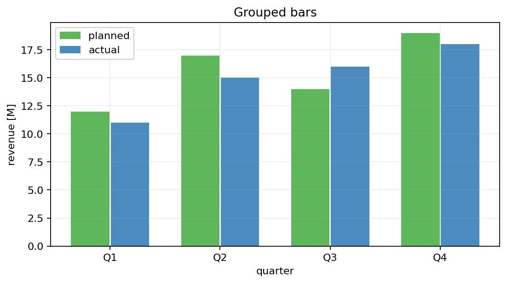
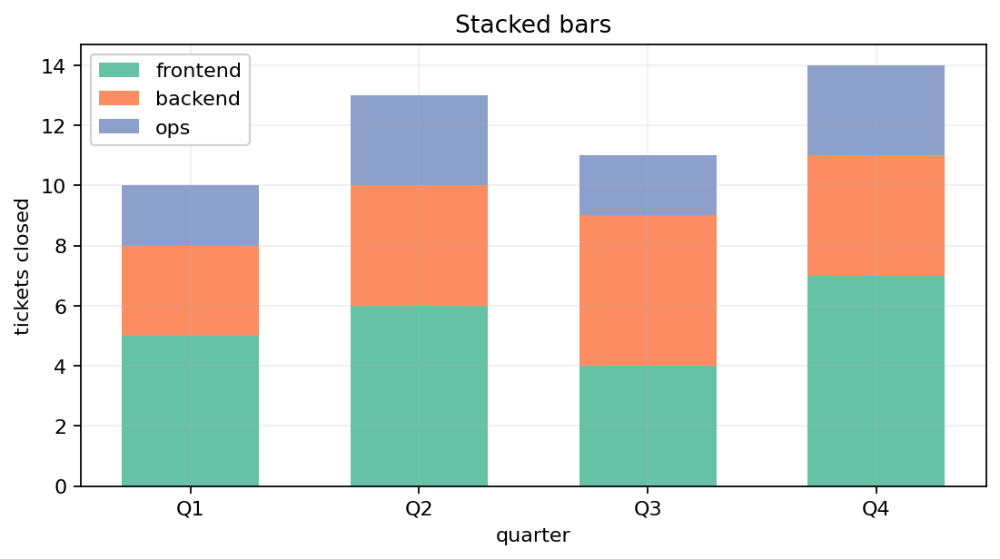
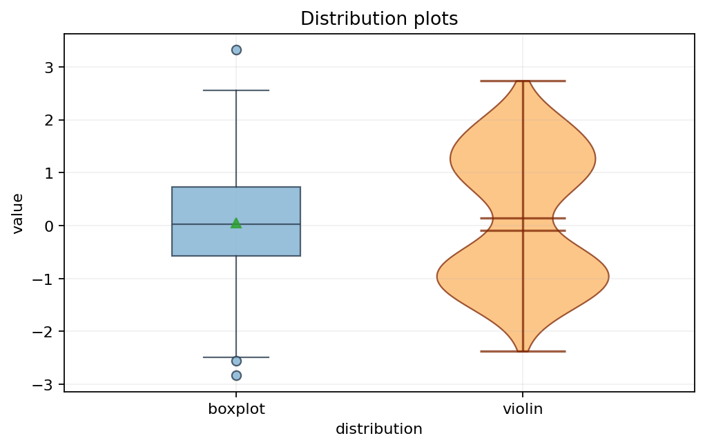
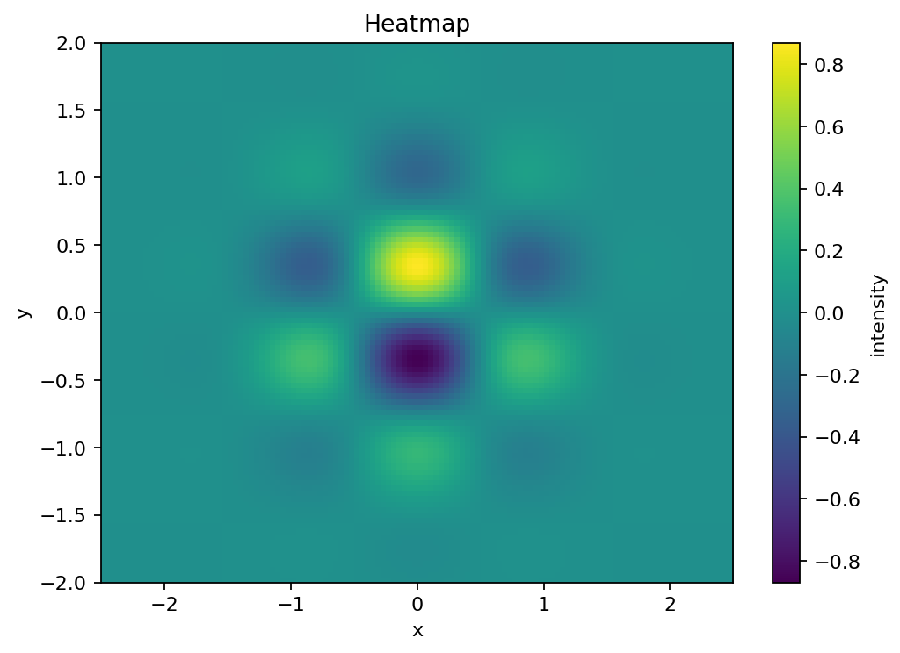
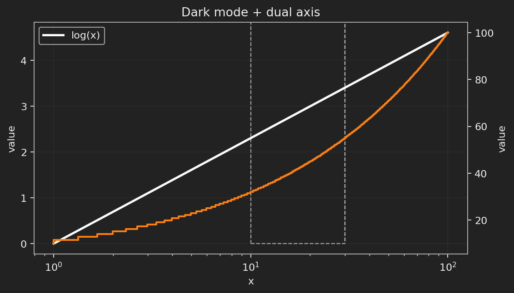
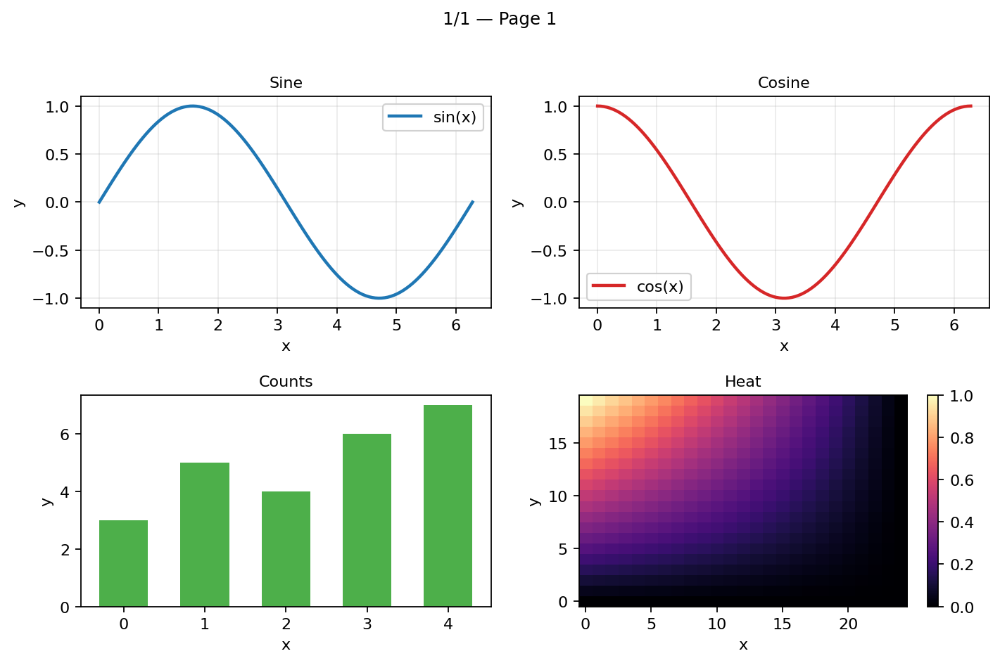
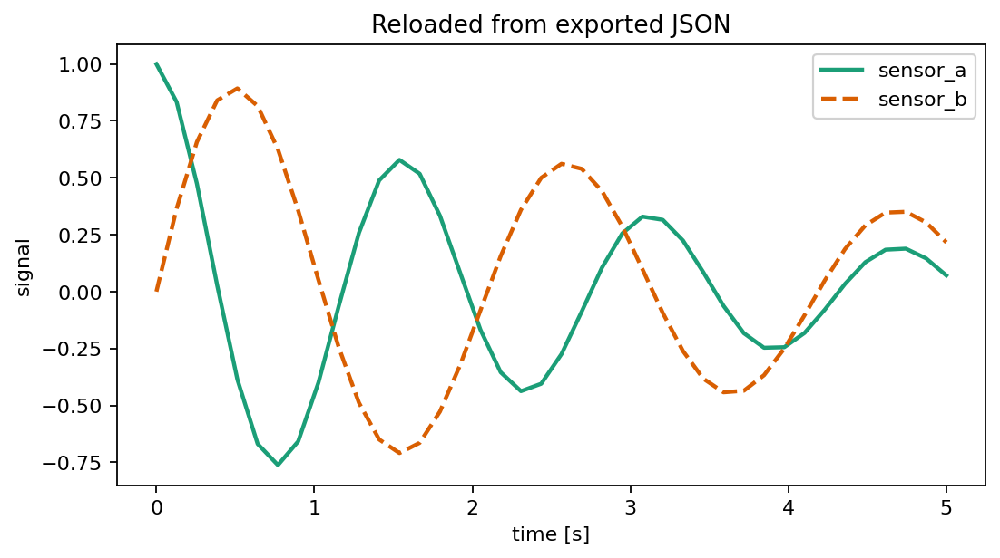

<!-- Copyright (c) Maximilian Dornik 2026. All rights reserved. -->

# CIPlot — a comforting `matplotlib` wrapper for repeatable, interactive plots

### Version Information

<p align="center">

| Currently, the latest version of the library is: |
|-----------|
| **CIPlot Beta 1.5.3** |

</p>

---

## What is CIPlot?

CIPlot is a lightweight plotting helper library built on top of Matplotlib. It wraps the repetitive parts of figure setup into a set of dataclass-based configuration objects, so you can describe plots declaratively instead of repeatedly re-writing scattered `pyplot` boilerplate in every project.

The library entry point is `ciplot.py`, and the public API is centered around:

- `plot_xy(...)`
- `browse_series(...)`
- `browse_structured_subplot_pages(...)`

plus a set of reusable configuration dataclasses such as `SeriesCfg`, `PlotCfg`, `AxisCfg`, `GridCfg`, `LegendCfg`, `ExportCfg`, `MarkingObjectCfg`, `DistributionPlotCfg`, and `HeatmapPlotCfg`.

---

## Why use CIPlot?

When plotting directly with raw `matplotlib.pyplot`, many projects end up repeating the same setup code over and over again:

- figure creation
- labels, limits, ticks, scales, and grids
- legends and legend placement
- error bars and confidence bands
- exporting figures and exporting the plotted data
- dark mode adjustments (this is really essential you know...)
- interactivity such as clickable legends or hover highlighting
- re-usable page-by-page browsing of related plots

CIPlot bundles those concerns into structured config objects. That gives you a few practical benefits:

- **Less boilerplate:** common plotting setup lives in config objects instead of being re-written for every script.
- **More consistency:** plots in the same project share the same style and behavior more easily.
- **Better reuse:** you can export and restore both data and general plotting settings.
- **A smoother path from simple to advanced plots:** the same entry point can handle lines, scatter plots, bars, stacked bars, boxplots, violins, and heatmaps.
- **Interactive workflows without custom glue code:** browsing pages, hover highlighting, clickable legends, and export workflows are already included.

In practice, CIPlot is especially useful when you have many analysis scripts and you are tired of maintaining a growing pile of one-off Matplotlib snippets.

---

## What CIPlot can do

CIPlot currently supports:

- **Line-based plots**: line, scatter, step and stem
- **Bar-based plots**: bar, stacked_bar, and grouped bar
- **Distribution-based plots**: boxplot and violin
- **Matrix-style plots**: heatmap

On top of that, it supports:

- dark mode
- confidence bands
- x/y error bars
- axis scaling (`linear`, `log`, `symlog`, `logit`)
- explicit tick values, tick steps, custom tick formatters, tick rotation
- grids
- markings such as lines, rectangles, circles, ellipses, arrows, and text
- background images
- exporting figures
- exporting plotted data as JSON
- restoring series and settings from exported JSON
- interactive legends
- hover highlighting
- browsable pages of plots
- structured multi-subplot browse pages

---

## Installation and usage

CIPlot is designed to be installed like a standard Python package.

### Install from a local checkout (recommended for development)

Clone the repository and install it in editable mode:

```bash
git clone "https://github.com/D4rkf1eld/CIPlot.git"
cd CIPlot
pip install -e .
```

Editable mode `(-e)` means changes to the source code are immediately reflected without reinstalling.

### Install dependencies

CIPlot depends on:

```bash
pip install matplotlib numpy
```

If CIPlot is installed via `pyproject.toml`, these dependencies are installed automatically.

### Import CIPlot

After installation, simply import it:

```python
import ciplot as cplt
```

### Verify installation

You can quickly verify everything works:

```python
import ciplot as cplt

print(cplt._get_version()) # This should print the current version, e.g. "CIPlot Beta 1.5.3".
```

---

## Configuration overview

Here is the rough mental model:

- **`SeriesCfg`** describes one simplified plotted thing like a curve.
- **`DistributionPlotCfg`** configures boxplots and violin plots within that thing.
- **`HeatmapPlotCfg`** configures heatmaps and colorbars within that thing.

<!-- Separator -->

- **`MarkingObjectCfg`** adds overlays such as guide lines, rectangles, circles, arrows, and labels.
- **`BackgroundImageCfg`** places images behind a plot.

<!-- Separator -->

- **`PlotCfg`** describes figure-wide behavior and interactivity.
- **`AxisCfg`** and **`TickCfg`** describe axes, limits, scaling, and tick behavior.
- **`GridCfg`** describes major and minor grids.
- **`LegendCfg`** describes legend placement and interactions.
- **`ExportCfg`** controls file export and data export.

<!-- Separator -->

- **`BrowsePageSettingsCfg`**, **`BrowseSubplotCfg`**, and **`BrowseStructuredPageCfg`** support interactive browsing workflows.

---

## Quick start

This is the smallest useful example. It already shows the main idea: most plot behavior goes into structured config objects instead of being scattered across many `plt.*` calls.

```python
import numpy as np
import ciplot as cplt

# Create x-values for one smooth sine curve.
x_values = np.linspace(0.0, 2.0 * np.pi, 300)

# Each plotted element is described by a SeriesCfg.
series = [
    cplt.SeriesCfg(
        x_values = x_values,
        y_values = np.sin(x_values),
        label = "sin(x)",
        plotting_style = {"color": "#3366cc", "linewidth": 2.5},
    ),
]

# plot_xy() draws all series with the given plot, axis, grid, and legend settings.
cplt.plot_xy(
    series = series,
    plot_cfg = cplt.PlotCfg(plot_title = "Quick start: plot_xy()", figure_size = (7, 4), show_plot = True),
    x_axis_cfg = cplt.AxisCfg(axis_label = "x"),
    y_axis_cfg = cplt.AxisCfg(axis_label = "y"),
    grid_cfg = cplt.GridCfg(show_major_grid = True, major_grid_style = {"alpha": 0.3}),
    legend_cfg = cplt.LegendCfg(show_legend = True),
)
```



---

## Basic examples

### 1) Scatter plot plus fitted curve and confidence band

This example combines multiple series types in one figure and adds a marking.

```python
import numpy as np
import ciplot as cplt

# Use a fixed random seed so the example always looks the same.
random_generator = np.random.default_rng(7)

# Build some example measurement data and a smoother fitted curve.
x_values = np.linspace(0.0, 10.0, 40)
baseline_values = 0.7 * x_values + 1.5 * np.sin(0.8 * x_values)
observed_values = baseline_values + random_generator.normal(0.0, 0.7, size = x_values.size)

fit_values = 0.72 * x_values + 1.2 * np.sin(0.8 * x_values)
spread_values = 0.9 + 0.15 * x_values

# The first series is shown as scatter points, the second as a fitted line.
series = [
    cplt.SeriesCfg(
        x_values = x_values,
        y_values = observed_values,
        label = "measurements",
        plotting_kind = "scatter",
        plotting_style = {"color": "#1f77b4", "s": 28, "alpha": 0.8},
    ),
    cplt.SeriesCfg(
        x_values = x_values,
        y_values = fit_values,
        label = "fit",
        plotting_style = {"color": "#d62728", "linewidth": 2.2},
        confidence_band_values = (fit_values - spread_values, fit_values + spread_values),
    ),
]

# Markings are optional overlays such as guide lines and labels.
markings = [
    cplt.MarkingObjectCfg(
        marking_object_kind = "vline",
        x = 5.0,
        marking_object_style = {"color": "#555555", "linestyle": "--", "linewidth": 1.2},
    ),
    cplt.MarkingObjectCfg(
        marking_object_kind = "text",
        x = 5.05,
        y = np.max(fit_values + spread_values) - 0.5,
        text = "transition",
        marking_object_style = {"fontsize": 10, "color": "#555555"},
    ),
]

cplt.plot_xy(
    series = series,
    markings = markings,
    plot_cfg = cplt.PlotCfg(plot_title = "Scatter + fitted curve + confidence band", figure_size = (7.4, 4.2), show_plot = True),
    x_axis_cfg = cplt.AxisCfg(axis_label = "time [s]"),
    y_axis_cfg = cplt.AxisCfg(axis_label = "response"),
    grid_cfg = cplt.GridCfg(show_major_grid = True, major_grid_style = {"alpha": 0.25}),
    legend_cfg = cplt.LegendCfg(show_legend = True),
)
```



---

### 2) Grouped bars

```python
import numpy as np
import ciplot as cplt

# Use simple numeric x-positions for the bars.
quarter_positions = np.arange(4)
quarter_labels = ["Q1", "Q2", "Q3", "Q4"]

# Two bar series with small x-offsets create grouped bars.
series = [
    cplt.SeriesCfg(
        x_values = quarter_positions,
        y_values = [12, 17, 14, 19],
        label = "planned",
        plotting_kind = "bar",
        plotting_style = {"width": 0.35, "x_offset": -0.18, "color": "#4daf4a", "alpha": 0.9},
    ),
    cplt.SeriesCfg(
        x_values = quarter_positions,
        y_values = [11, 15, 16, 18],
        label = "actual",
        plotting_kind = "bar",
        plotting_style = {"width": 0.35, "x_offset": 0.18, "color": "#377eb8", "alpha": 0.9},
    ),
]

# TickCfg is used here to turn the numeric bar positions into quarter labels.
cplt.plot_xy(
    series = series,
    plot_cfg = cplt.PlotCfg(plot_title = "Grouped bars", figure_size = (7, 4), show_plot = True),
    x_axis_cfg = cplt.AxisCfg(
        axis_label = "quarter",
        axis_ticks = cplt.TickCfg(
            tick_values = quarter_positions,
            tick_formatter = lambda value, index: quarter_labels[index] if 0 <= index < len(quarter_labels) else "",
        ),
    ),
    y_axis_cfg = cplt.AxisCfg(axis_label = "revenue [M]"),
    grid_cfg = cplt.GridCfg(show_major_grid = True, major_grid_style = {"alpha": 0.2}),
    legend_cfg = cplt.LegendCfg(show_legend = True),
)
```



---

### 3) Stacked bars

```python
import numpy as np
import ciplot as cplt

# Reuse fixed x-positions and custom labels for the quarters.
quarter_positions = np.arange(4)
quarter_labels = ["Q1", "Q2", "Q3", "Q4"]

# Using plotting_kind = "stacked_bar" tells CIPlot to stack the series vertically.
series = [
    cplt.SeriesCfg(
        x_values = quarter_positions,
        y_values = [5, 6, 4, 7],
        label = "frontend",
        plotting_kind = "stacked_bar",
        plotting_style = {"width": 0.6, "color": "#66c2a5"},
    ),
    cplt.SeriesCfg(
        x_values = quarter_positions,
        y_values = [3, 4, 5, 4],
        label = "backend",
        plotting_kind = "stacked_bar",
        plotting_style = {"width": 0.6, "color": "#fc8d62"},
    ),
    cplt.SeriesCfg(
        x_values = quarter_positions,
        y_values = [2, 3, 2, 3],
        label = "ops",
        plotting_kind = "stacked_bar",
        plotting_style = {"width": 0.6, "color": "#8da0cb"},
    ),
]

cplt.plot_xy(
    series = series,
    plot_cfg = cplt.PlotCfg(plot_title = "Stacked bars", figure_size = (7, 4), show_plot = True),
    x_axis_cfg = cplt.AxisCfg(
        axis_label = "quarter",
        axis_ticks = cplt.TickCfg(
            tick_values = quarter_positions,
            tick_formatter = lambda value, index: quarter_labels[index] if 0 <= index < len(quarter_labels) else "",
        ),
    ),
    y_axis_cfg = cplt.AxisCfg(axis_label = "tickets closed"),
    grid_cfg = cplt.GridCfg(show_major_grid = True, major_grid_style = {"alpha": 0.2}),
    legend_cfg = cplt.LegendCfg(show_legend = True),
)
```



---

## Distribution and matrix-style examples

### 4) Boxplot and violin plot

CIPlot does not only wrap line-style plots. It also supports distribution-style plotting through `DistributionPlotCfg`.

```python
import numpy as np
import ciplot as cplt

# Fixed seed for repeatable random example data.
random_generator = np.random.default_rng(3)

# Example samples for the two distribution plots.
box_values = random_generator.normal(0.0, 1.0, 300)
violin_values = np.concatenate([
    random_generator.normal(-1.0, 0.45, 180),
    random_generator.normal(1.2, 0.6, 180),
])

# DistributionPlotCfg holds the actual sample values for boxplots and violins.
series = [
    cplt.SeriesCfg(
        label = "box",
        plotting_kind = "boxplot",
        distribution_plot_cfg = cplt.DistributionPlotCfg(
            distribution_values = box_values,
            distribution_position = 1.0,
            distribution_width = 0.45,
            boxplot_showmeans = True,
        ),
        plotting_style = {"facecolor": "#80b1d3", "edgecolor": "#2c3e50", "alpha": 0.8},
    ),
    cplt.SeriesCfg(
        label = "violin",
        plotting_kind = "violin",
        distribution_plot_cfg = cplt.DistributionPlotCfg(
            distribution_values = violin_values,
            distribution_position = 2.0,
            distribution_width = 0.6,
            violin_showmeans = True,
        ),
        plotting_style = {"facecolor": "#fdb462", "edgecolor": "#7f2704", "alpha": 0.75},
    ),
]

# Custom x-axis labels make the distribution positions easier to read.
distribution_labels = ["boxplot", "violin"]

cplt.plot_xy(
    series = series,
    plot_cfg = cplt.PlotCfg(plot_title = "Distribution plots", figure_size = (6.5, 4.2), show_plot = True),
    x_axis_cfg = cplt.AxisCfg(
        axis_label = "distribution",
        axis_limits = (0.4, 2.6),
        axis_ticks = cplt.TickCfg(
            tick_values = [1.0, 2.0],
            tick_formatter = lambda value, index: distribution_labels[index] if 0 <= index < len(distribution_labels) else "",
        ),
    ),
    y_axis_cfg = cplt.AxisCfg(axis_label = "value"),
    grid_cfg = cplt.GridCfg(show_major_grid = True, major_grid_style = {"alpha": 0.18}),
)
```



---

### 5) Heatmap with colorbar

Matrix-style plots are handled with `HeatmapPlotCfg`.

```python
import numpy as np
import ciplot as cplt

# Create a 2D grid of x/y coordinates.
x_grid = np.linspace(-2.5, 2.5, 120)
y_grid = np.linspace(-2.0, 2.0, 100)
x_mesh, y_mesh = np.meshgrid(x_grid, y_grid)

# Build a 2D matrix that will be shown as a heatmap.
heatmap_values = np.exp(-(x_mesh ** 2 + y_mesh ** 2)) * np.cos(3 * x_mesh) * np.sin(4 * y_mesh)

# Heatmap data is passed through HeatmapPlotCfg instead of x/y values.
series = [
    cplt.SeriesCfg(
        label = "field strength",
        plotting_kind = "heatmap",
        heatmap_plot_cfg = cplt.HeatmapPlotCfg(
            heatmap_values = heatmap_values,
            heatmap_extent = (-2.5, 2.5, -2.0, 2.0),
            heatmap_origin = "lower",
            heatmap_colormap = "viridis",
            heatmap_show_colorbar = True,
            heatmap_colorbar_label = "intensity",
        ),
    ),
]

cplt.plot_xy(
    series = series,
    plot_cfg = cplt.PlotCfg(plot_title = "Heatmap", figure_size = (6.6, 4.8), show_plot = True),
    x_axis_cfg = cplt.AxisCfg(axis_label = "x"),
    y_axis_cfg = cplt.AxisCfg(axis_label = "y"),
)
```



---

## More advanced features

### 6) Dark mode, log axis, step plot, and a second y-axis

This example shows several advanced capabilities in one place:

- dark mode
- log-scaled x-axis
- plotting on the right y-axis
- markings
- automatic flipping of explicit black line colors in dark mode

```python
import numpy as np
import ciplot as cplt

# Use positive x-values because the x-axis is shown on a log scale.
x_values = np.linspace(1.0, 100.0, 300)

# The second series is drawn on the right y-axis.
series = [
    cplt.SeriesCfg(
        x_values = x_values,
        y_values = np.log(x_values),
        label = "log(x)",
        plotting_style = {"color": "black", "linewidth": 2.2},
    ),
    cplt.SeriesCfg(
        x_values = x_values,
        y_values = 10.0 * np.sqrt(x_values),
        label = "10 * sqrt(x)",
        plotting_kind = "step",
        plotting_style = {"color": "#ff7f0e", "linewidth": 1.8},
        plot_on_which_y_axis = "right",
    ),
]

# This rectangle is just a visual highlight on the plot.
markings = [
    cplt.MarkingObjectCfg(
        marking_object_kind = "rectangle",
        x = 10.0,
        y = 0.0,
        width = 20.0,
        height = 20.0,
        marking_object_style = {"fill": False, "edgecolor": "#bbbbbb", "linestyle": "--"},
    ),
]

cplt.plot_xy(
    series = series,
    markings = markings,
    plot_cfg = cplt.PlotCfg(
        plot_title = "Dark mode + dual axis",
        figure_size = (7.2, 4.2),
        show_plot = True,
        enable_dark_mode = True,
    ),
    x_axis_cfg = cplt.AxisCfg(axis_label = "x", axis_scaling = "log"),
    y_axis_cfg = cplt.AxisCfg(axis_label = "value"),
    grid_cfg = cplt.GridCfg(show_major_grid = True, major_grid_style = {"alpha": 0.25}),
    legend_cfg = cplt.LegendCfg(show_legend = True),
)
```



---

## Interactive browsing

### 7) Browse a list of plots page by page

`browse_series(...)` is useful when you want to step through many related plots in one interactive window instead of opening many separate figures.

When `multi_series = None`, each `SeriesCfg` becomes its own page.

When `multi_series` is provided, each inner list becomes one page.

```python
import numpy as np
import ciplot as cplt

# One shared x-axis for all pages.
x_values = np.linspace(0.0, 2.0 * np.pi, 200)

# Each SeriesCfg becomes one page because multi_series is not used here.
series = [
    cplt.SeriesCfg(
        x_values = x_values,
        y_values = np.sin(x_values + phase_shift),
        label = f"phase = {phase_shift:.2f}",
        plotting_style = {"linewidth": 2.0},
    )
    for phase_shift in np.linspace(0.0, np.pi, 6)
]

# browse_series() opens one interactive window and lets you move through the pages.
cplt.browse_series(
    series = series,
    plot_cfg = cplt.PlotCfg(
        plot_title = "Phase sweep",
        figure_size = (7, 4),
        show_plot = True,
        enable_hover_highlight = True,
        hover_show_tooltip = True,
    ),
    x_axis_cfg = cplt.AxisCfg(axis_label = "x"),
    y_axis_cfg = cplt.AxisCfg(axis_label = "sin(x + phase)"),
    grid_cfg = cplt.GridCfg(show_major_grid = True, major_grid_style = {"alpha": 0.25}),
    legend_cfg = cplt.LegendCfg(show_legend = True, legend_is_clickable = True),
)
```

### Browse controls

Inside a browse window, CIPlot supports these keys:

- `Right`, `d`, `k`: next page
- `Left`, `a`, `j`: previous page
- `Home`: first page
- `End`: last page
- `h`: hide all legend entries
- `u`: unhide all legend entries
- `q` or `Escape`: close the window

---

## Structured pages with multiple subplots

### 8) Build multi-row, multi-column browse pages

For more complex interactive dashboards, CIPlot supports structured pages with rows of subplots.

```python
import numpy as np
import ciplot as cplt

# Shared x-values for the sine and cosine subplots.
x_values = np.linspace(0.0, 2.0 * np.pi, 120)

# A structured page is built from rows of BrowseSubplotCfg objects.
structured_pages = [
    cplt.BrowseStructuredPageCfg(
        page_title = "Page 1",
        rows = [
            [
                cplt.BrowseSubplotCfg(
                    series = [
                        cplt.SeriesCfg(
                            x_values = x_values,
                            y_values = np.sin(x_values),
                            label = "sin(x)",
                            plotting_style = {"color": "#1f77b4", "linewidth": 2.0},
                        ),
                    ],
                    plot_cfg = cplt.PlotCfg(plot_title = "Sine"),
                    grid_cfg = cplt.GridCfg(show_major_grid = True, major_grid_style = {"alpha": 0.25}),
                    legend_cfg = cplt.LegendCfg(show_legend = True),
                ),
                cplt.BrowseSubplotCfg(
                    series = [
                        cplt.SeriesCfg(
                            x_values = x_values,
                            y_values = np.cos(x_values),
                            label = "cos(x)",
                            plotting_style = {"color": "#d62728", "linewidth": 2.0},
                        ),
                    ],
                    plot_cfg = cplt.PlotCfg(plot_title = "Cosine"),
                    grid_cfg = cplt.GridCfg(show_major_grid = True, major_grid_style = {"alpha": 0.25}),
                    legend_cfg = cplt.LegendCfg(show_legend = True),
                ),
            ],
            [
                cplt.BrowseSubplotCfg(
                    series = [
                        cplt.SeriesCfg(
                            x_values = np.arange(5),
                            y_values = [3, 5, 4, 6, 7],
                            label = "counts",
                            plotting_kind = "bar",
                            plotting_style = {"color": "#4daf4a", "width": 0.6},
                        ),
                    ],
                    plot_cfg = cplt.PlotCfg(plot_title = "Counts"),
                ),
                cplt.BrowseSubplotCfg(
                    series = [
                        cplt.SeriesCfg(
                            label = "heat",
                            plotting_kind = "heatmap",
                            heatmap_plot_cfg = cplt.HeatmapPlotCfg(
                                heatmap_values = np.outer(np.linspace(0, 1, 20), np.linspace(1, 0, 25)),
                                heatmap_origin = "lower",
                                heatmap_show_colorbar = True,
                                heatmap_colormap = "magma",
                            ),
                        ),
                    ],
                    plot_cfg = cplt.PlotCfg(plot_title = "Heat"),
                ),
            ],
        ],
        # Page-level defaults can be shared across all subplots on this page.
        page_settings_cfg = cplt.BrowsePageSettingsCfg(
            plot_cfg = cplt.PlotCfg(plot_title = "Structured page", figure_size = (9, 6), show_plot = True),
            x_axis_cfg = cplt.AxisCfg(axis_label = "x"),
            y_axis_cfg = cplt.AxisCfg(axis_label = "y"),
        ),
    ),
]

cplt.browse_structured_subplot_pages(
    structured_pages = structured_pages,
    plot_cfg = cplt.PlotCfg(figure_size = (9, 6), show_plot = True),
    x_axis_cfg = cplt.AxisCfg(axis_label = "x"),
    y_axis_cfg = cplt.AxisCfg(axis_label = "y"),
)
```



---

## Exporting figures and data

CIPlot can export figures and the plotted series data.

### Export a figure and its underlying series data

```python
import numpy as np
import ciplot as cplt

# Example x-values for two damped signals.
x_values = np.linspace(0.0, 5.0, 40)

series = [
    cplt.SeriesCfg(
        x_values = x_values,
        y_values = np.exp(-0.35 * x_values) * np.cos(4.0 * x_values),
        label = "sensor_a",
        plotting_style = {"color": "#1b9e77", "linewidth": 2.0},
    ),
    cplt.SeriesCfg(
        x_values = x_values,
        y_values = np.exp(-0.22 * x_values) * np.sin(3.0 * x_values),
        label = "sensor_b",
        plotting_style = {"color": "#d95f02", "linewidth": 2.0, "linestyle": "--"},
    ),
]

# show_plot = False is useful when the goal is exporting files only.
cplt.plot_xy(
    series = series,
    plot_cfg = cplt.PlotCfg(plot_title = "Export example", figure_size = (7, 4), show_plot = False),
    x_axis_cfg = cplt.AxisCfg(axis_label = "time [s]"),
    y_axis_cfg = cplt.AxisCfg(axis_label = "signal"),
    legend_cfg = cplt.LegendCfg(show_legend = True),
    export_cfg = cplt.ExportCfg(
        enable_export = True,
        enable_data_export = True,
        data_export_with_style = True,
        output_directory = "exports",
        export_name = "export_example",
        export_data_name = "export_example_data",
        output_formats = ("png", "pdf"),
    ),
)
```

This writes:

- `exports/export_example.png`
- `exports/export_example.pdf`
- `exports/export_example_data.json`

### Load series back from exported JSON

```python
import ciplot as cplt

# Restore the exported series and also restore their saved plotting styles.
restored_series = cplt.series_from_exported_series_data_json(
    filepath = "exports/export_example_data.json",
    restore_with_style = True,
)

# Plot the restored series like any normal CIPlot series list.
cplt.plot_xy(
    series = restored_series,
    plot_cfg = cplt.PlotCfg(plot_title = "Reloaded from exported JSON", figure_size = (7, 4), show_plot = True),
    x_axis_cfg = cplt.AxisCfg(axis_label = "time [s]"),
    y_axis_cfg = cplt.AxisCfg(axis_label = "signal"),
    legend_cfg = cplt.LegendCfg(show_legend = True),
)
```



---

## Saving and restoring reusable plotting settings

CIPlot can also serialize general dataclass-based settings, not just plotted series.

```python
import ciplot as cplt

# Save reusable plot settings to JSON.
cplt.export_general_dataclasses_settings_to_json(
    filepath = "plot_defaults.json",
    plot_cfg = cplt.PlotCfg(plot_title = "Reusable defaults", figure_size = (8, 4), show_plot = False),
    x_axis_cfg = cplt.AxisCfg(axis_label = "epoch"),
    y_axis_cfg = cplt.AxisCfg(axis_label = "loss"),
    legend_cfg = cplt.LegendCfg(show_legend = True),
)

# Load the saved settings back into Python dataclasses.
restored_settings = cplt.restore_general_dataclasses_settings_from_json(filepath = "plot_defaults.json")

# Reuse the restored settings for a new plot.
cplt.plot_xy(
    series = [
        cplt.SeriesCfg(
            x_values = [1, 2, 3, 4],
            y_values = [0.9, 0.6, 0.45, 0.35],
            label = "training loss",
            plotting_style = {"linewidth": 2.0},
        ),
    ],
    plot_cfg = restored_settings["plot_cfg"],
    x_axis_cfg = restored_settings["x_axis_cfg"],
    y_axis_cfg = restored_settings["y_axis_cfg"],
    legend_cfg = restored_settings["legend_cfg"],
)
```

This is handy when you want a project-level plotting style that stays versioned in JSON.

---

## Useful wrapper utilities

### Get a palette and apply it to many series

```python
import numpy as np
import ciplot as cplt

# Create a few base curves first.
x_values = np.linspace(0.0, 2.0 * np.pi, 200)

base_series = [
    cplt.SeriesCfg(
        x_values = x_values,
        y_values = np.sin(x_values + shift_value),
        label = f"curve_{curve_index}",
    )
    for curve_index, shift_value in enumerate(np.linspace(0.0, 1.5, 5), start = 1)
]

# Ask CIPlot for a matching number of colors from a named palette.
palette_colors = cplt.get_color_palette(num_colors = len(base_series), palette_name = "Set2")

# Apply those colors to the series without rebuilding each SeriesCfg by hand.
styled_series = cplt.apply_settings_with_values_to_series_elements(
    series = base_series,
    settings_with_values = [
        {"plotting_style": {"color": color_value, "linewidth": 2.0}}
        for color_value in palette_colors
    ],
)

cplt.plot_xy(
    series = styled_series,
    plot_cfg = cplt.PlotCfg(plot_title = "Palette utility example", figure_size = (7, 4), show_plot = True),
    legend_cfg = cplt.LegendCfg(show_legend = True),
)
```

### See available palette names

```python
import ciplot as cplt

# Print a few available matplotlib palette names that CIPlot can use.
palette_names = cplt.get_all_color_palette_names()
print(palette_names[:20])
```

### Flatten multi-page content into one list

```python
import ciplot as cplt

# Convert a page-based structure into one flat list of series.
flat_series = cplt.convert_multi_series_to_series(
    multi_series = [
        [
            cplt.SeriesCfg(x_values = [0, 1], y_values = [0, 1], label = "a"),
            cplt.SeriesCfg(x_values = [0, 1], y_values = [1, 2], label = "b"),
        ],
        [
            cplt.SeriesCfg(x_values = [0, 1], y_values = [2, 3], label = "c"),
        ],
    ],
)
```

### Transpose page/graph grouping

If your current `multi_series` structure is grouped by pages but you want to regroup it by graph position, use:

```python
import ciplot as cplt

# Re-group the structure so matching graph positions end up together.
transposed_multi_series = cplt.swap_transpose_multi_series_pages_content_with_graphs(
    multi_series = [
        [series_a_1, series_a_2, series_a_3],
        [series_b_1, series_b_2],
    ],
)
```

That converts:

```python
[
    [series_a_1, series_a_2, series_a_3],
    [series_b_1, series_b_2],
]
```

into:

```python
[
    [series_a_1, series_b_1],
    [series_a_2, series_b_2],
    [series_a_3],
]
```

---

## A tiny mental checklist for new plots

When starting a new CIPlot figure, think in this order:

1. Build one or more `SeriesCfg` objects.
2. Add a `PlotCfg`.
3. Add axis, grid, and legend config.
4. Add markings, background, and export config only if needed.
5. Call `plot_xy(...)` for ordinary figures.
6. Call `browse_series(...)` or `browse_structured_subplot_pages(...)` for interactive multi-page workflows.

That is usually enough to keep plotting code compact, consistent, and easy to extend.

---

## License

Copyright (c) D4rkf1eld 2026.  
See the repository’s license file for details.